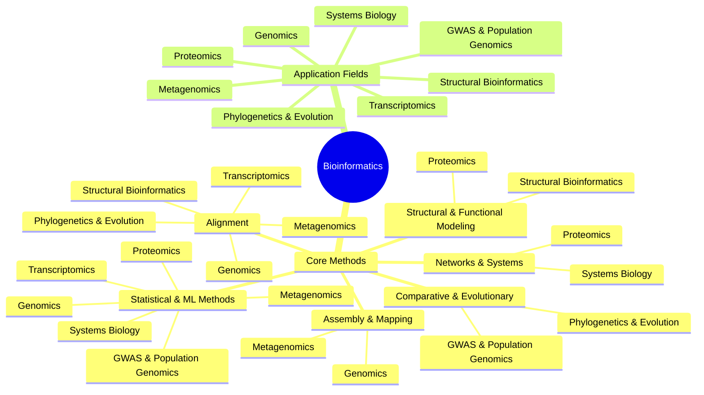

Map of Bioinformatics Fields, Methods & Principles:

```mermaid
mindmap
  root((Bioinformatics))
    Core Methods
      Alignment
        Genomics
        Transcriptomics
        Metagenomics
        Phylogenetics & Evolution
        Structural Bioinformatics
      Assembly & Mapping
        Genomics
        Metagenomics
      Statistical & ML Methods
        Genomics
        Transcriptomics
        Proteomics
        Metagenomics
        GWAS & Population Genomics
        Systems Biology
      Structural & Functional Modeling
        Proteomics
        Structural Bioinformatics
      Networks & Systems
        Proteomics
        Systems Biology
      Comparative & Evolutionary
        Phylogenetics & Evolution
        GWAS & Population Genomics
    Application Fields
      Genomics
      Transcriptomics
      Proteomics
      Metagenomics
      Phylogenetics & Evolution
      GWAS & Population Genomics
      Systems Biology
      Structural Bioinformatics
```
