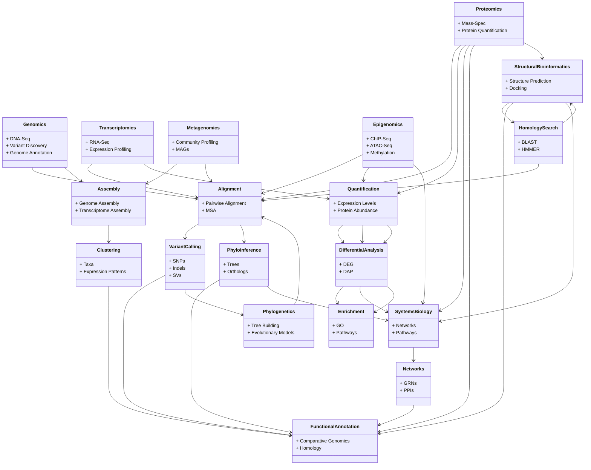
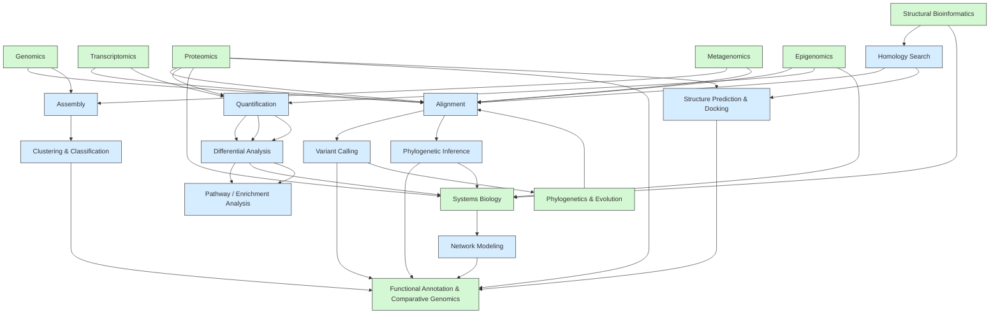
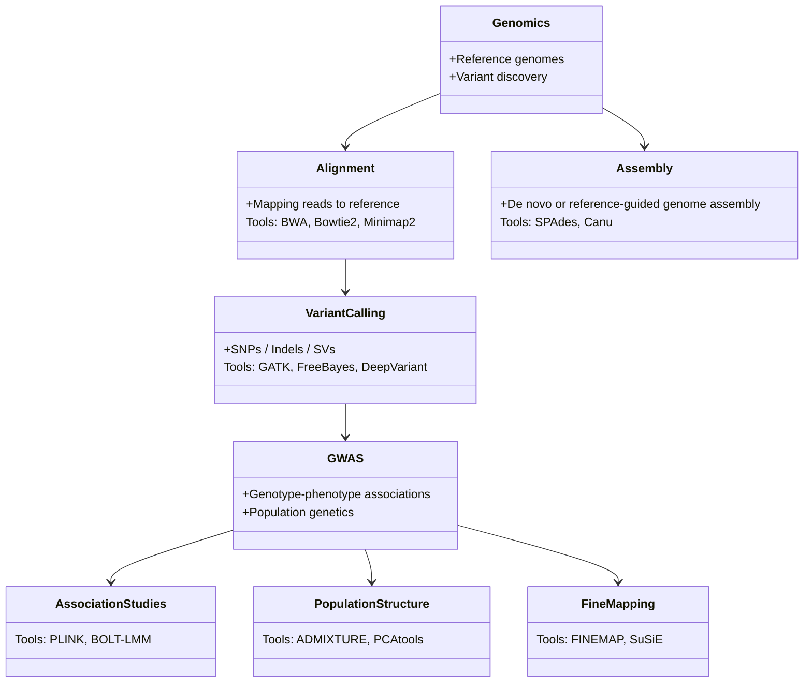
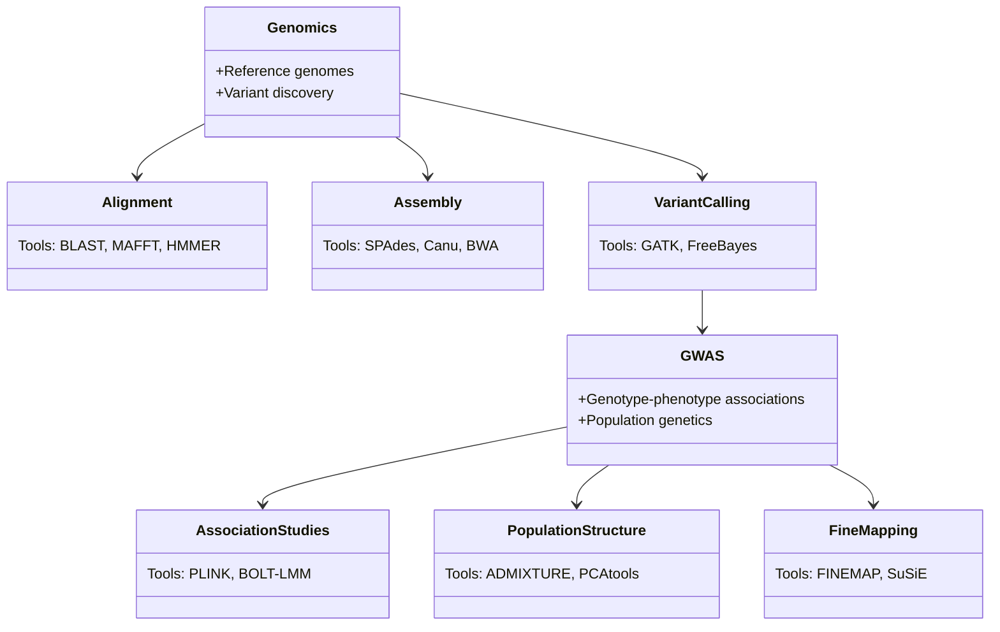
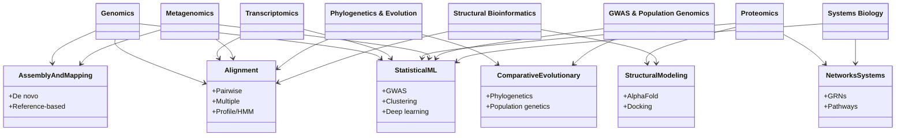
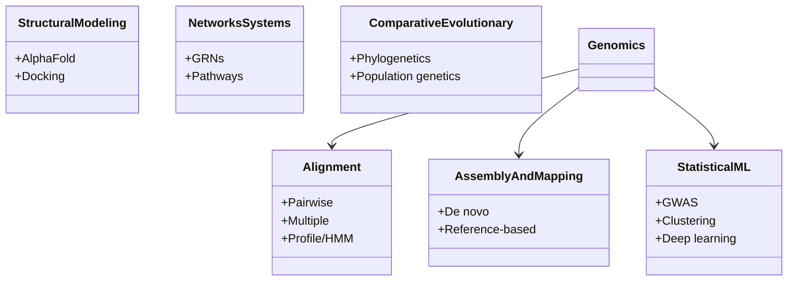

all:

```mermaid
classDiagram

  %% === FIELDS ===
  class Genomics {
    + DNA-Seq
    + Variant Discovery
    + Genome Annotation
  }
  class Transcriptomics {
    + RNA-Seq
    + Expression Profiling
  }
  class Proteomics {
    + Mass-Spec
    + Protein Quantification
  }
  class Metagenomics {
    + Community Profiling
    + MAGs
  }
  class Epigenomics {
    + ChIP-Seq
    + ATAC-Seq
    + Methylation
  }
  class StructuralBioinformatics {
    + Structure Prediction
    + Docking
  }
  class Phylogenetics {
    + Tree Building
    + Evolutionary Models
  }
  class SystemsBiology {
    + Networks
    + Pathways
  }
  class FunctionalAnnotation {
    + Comparative Genomics
    + Homology
  }

  %% === METHODS ===
  class Alignment {
    + Pairwise Alignment
    + MSA
  }
  class Assembly {
    + Genome Assembly
    + Transcriptome Assembly
  }
  class VariantCalling {
    + SNPs
    + Indels
    + SVs
  }
  class Quantification {
    + Expression Levels
    + Protein Abundance
  }
  class DifferentialAnalysis {
    + DEG
    + DAP
  }
  class Enrichment {
    + GO
    + Pathways
  }
  class Clustering {
    + Taxa
    + Expression Patterns
  }
  class PhyloInference {
    + Trees
    + Orthologs
  }
  class Networks {
    + GRNs
    + PPIs
  }
  class HomologySearch {
    + BLAST
    + HMMER
  }

  %% === RELATIONS ===
  Genomics --> Alignment
  Genomics --> Assembly
  Alignment --> VariantCalling
  VariantCalling --> FunctionalAnnotation
  VariantCalling --> Phylogenetics

  Transcriptomics --> Alignment
  Transcriptomics --> Quantification
  Quantification --> DifferentialAnalysis
  DifferentialAnalysis --> Enrichment
  DifferentialAnalysis --> SystemsBiology

  Proteomics --> Alignment
  Proteomics --> Quantification
  Quantification --> DifferentialAnalysis
  Proteomics --> SystemsBiology
  Proteomics --> FunctionalAnnotation
  Proteomics --> StructuralBioinformatics

  Metagenomics --> Assembly
  Metagenomics --> Alignment
  Assembly --> Clustering
  Clustering --> FunctionalAnnotation

  Epigenomics --> Alignment
  Epigenomics --> Quantification
  Quantification --> DifferentialAnalysis
  DifferentialAnalysis --> Enrichment
  Epigenomics --> SystemsBiology

  StructuralBioinformatics --> HomologySearch
  HomologySearch --> Alignment
  HomologySearch --> StructuralBioinformatics
  StructuralBioinformatics --> FunctionalAnnotation
  StructuralBioinformatics --> SystemsBiology

  Phylogenetics --> Alignment
  Alignment --> PhyloInference
  PhyloInference --> FunctionalAnnotation
  PhyloInference --> SystemsBiology

  SystemsBiology --> Networks
  Networks --> FunctionalAnnotation
```

```mermaid
flowchart TD

  %% === STYLE DEFINITIONS ===
  classDef field fill:#d4f8d4,stroke:#333,stroke-width:1px;
  classDef method fill:#d6ecff,stroke:#333,stroke-width:1px;

  %% === FIELDS ===
  Genomics["Genomics"]:::field
  Transcriptomics["Transcriptomics"]:::field
  Proteomics["Proteomics"]:::field
  Metagenomics["Metagenomics"]:::field
  Epigenomics["Epigenomics"]:::field
  Structural["Structural Bioinformatics"]:::field
  Phylogenetics["Phylogenetics & Evolution"]:::field
  Systems["Systems Biology"]:::field
  Functional["Functional Annotation & Comparative Genomics"]:::field

  %% === METHODS ===
  Alignment["Alignment"]:::method
  Assembly["Assembly"]:::method
  VariantCalling["Variant Calling"]:::method
  Quantification["Quantification"]:::method
  Differential["Differential Analysis"]:::method
  Enrichment["Pathway / Enrichment Analysis"]:::method
  Clustering["Clustering & Classification"]:::method
  StructurePrediction["Structure Prediction & Docking"]:::method
  PhyloInference["Phylogenetic Inference"]:::method
  Networks["Network Modeling"]:::method
  Homology["Homology Search"]:::method

  %% === GENOMICS ===
  Genomics --> Alignment
  Genomics --> Assembly
  Alignment --> VariantCalling
  VariantCalling --> Functional
  VariantCalling --> Phylogenetics

  %% === TRANSCRIPTOMICS ===
  Transcriptomics --> Alignment
  Transcriptomics --> Quantification
  Quantification --> Differential
  Differential --> Enrichment
  Differential --> Systems

  %% === PROTEOMICS ===
  Proteomics --> Alignment
  Proteomics --> Quantification
  Quantification --> Differential
  Proteomics --> Systems
  Proteomics --> Functional
  Proteomics --> StructurePrediction

  %% === METAGENOMICS ===
  Metagenomics --> Assembly
  Metagenomics --> Alignment
  Assembly --> Clustering
  Clustering --> Functional

  %% === EPIGENOMICS ===
  Epigenomics --> Alignment
  Epigenomics --> Quantification
  Quantification --> Differential
  Differential --> Enrichment
  Epigenomics --> Systems

  %% === STRUCTURAL BIOINFORMATICS ===
  Structural --> Homology
  Homology --> Alignment
  Homology --> StructurePrediction
  StructurePrediction --> Functional
  Structural --> Systems

  %% === PHYLOGENETICS ===
  Phylogenetics --> Alignment
  Alignment --> PhyloInference
  PhyloInference --> Functional
  PhyloInference --> Systems

  %% === SYSTEMS BIOLOGY ===
  Systems --> Networks
  Networks --> Functional
```

```mermaid
classDiagram
    %% === GENOMICS ===
    class Genomics {
      *Field*
      Genome sequencing & variant discovery
    }
    class Alignment {
      Mapping reads to reference
      Tools: BWA, Bowtie2, Minimap2
    }
    class Assembly {
      De novo / reference-guided assembly
      Tools: SPAdes, Canu, Flye
    }
    class VariantCalling {
      SNPs, Indels, SVs
      Tools: GATK, FreeBayes, DeepVariant
    }
    class GWAS {
      *Field*
      Genotype–phenotype associations
    }
    class AssociationStudies {
      Tools: PLINK, BOLT-LMM
    }
    class PopulationStructure {
      Tools: ADMIXTURE, PCAtools
    }

    Genomics --> Alignment
    Genomics --> Assembly
    Alignment --> VariantCalling
    VariantCalling --> GWAS
    GWAS --> AssociationStudies
    GWAS --> PopulationStructure

    %% === TRANSCRIPTOMICS ===
    class Transcriptomics {
      *Field*
      Expression analysis
    }
    class RNAseq {
      Alignment / quantification
      Tools: STAR, Salmon
    }
    class DifferentialExpression {
      Tools: DESeq2, edgeR
    }
    class PathwayEnrichment {
      Tools: GSEA, ReactomePA
    }

    Transcriptomics --> RNAseq
    RNAseq --> DifferentialExpression
    DifferentialExpression --> PathwayEnrichment

    %% === PROTEOMICS ===
    class Proteomics {
      *Field*
      Protein ID & quantification
    }
    class MassSpec {
      MS/MS spectra analysis
      Tools: MaxQuant, ProteomeDiscoverer
    }
    class ProteinQuantification {
      Label-free, SILAC, TMT
    }
    class ProteinInteraction {
      Networks
      Tools: STRING, Cytoscape
    }

    Proteomics --> MassSpec
    MassSpec --> ProteinQuantification
    ProteinQuantification --> ProteinInteraction

    %% === METAGENOMICS ===
    class Metagenomics {
      *Field*
      Microbiome analysis
    }
    class TaxonomicProfiling {
      Tools: Kraken2, MetaPhlAn
    }
    class FunctionalProfiling {
      Tools: HUMAnN, EggNOG
    }

    Metagenomics --> TaxonomicProfiling
    Metagenomics --> FunctionalProfiling

    %% === STRUCTURAL BIOINFORMATICS ===
    class StructuralBioinfo {
      *Field*
      Protein/RNA 3D structure
    }
    class HomologyModeling {
      Tools: SWISS-MODEL, ModRefiner
    }
    class StructurePrediction {
      Tools: AlphaFold, Rosetta
    }
    class Docking {
      Tools: AutoDock, HADDOCK
    }

    StructuralBioinfo --> HomologyModeling
    StructuralBioinfo --> StructurePrediction
    StructuralBioinfo --> Docking

    %% === SYSTEMS BIOLOGY ===
    class SystemsBiology {
      *Field*
      Networks & dynamic modeling
    }
    class NetworkModeling {
      Tools: Cytoscape, igraph
    }
    class PathwaySimulation {
      Tools: CellDesigner, COPASI
    }

    SystemsBiology --> NetworkModeling
    SystemsBiology --> PathwaySimulation

    %% === PHYLOGENETICS ===
    class Phylogenetics {
      *Field*
      Evolutionary trees
    }
    class MultipleAlignment {
      Tools: Clustal, MAFFT
    }
    class TreeBuilding {
      Tools: RAxML, IQ-TREE, BEAST
    }

    Phylogenetics --> MultipleAlignment
    MultipleAlignment --> TreeBuilding

    %% === STYLING ===
    style Genomics fill:#d4f8d4,stroke:#333,stroke-width:1px
    style GWAS fill:#d4f8d4,stroke:#333,stroke-width:1px
    style Transcriptomics fill:#d4f8d4,stroke:#333,stroke-width:1px
    style Proteomics fill:#d4f8d4,stroke:#333,stroke-width:1px
    style Metagenomics fill:#d4f8d4,stroke:#333,stroke-width:1px
    style StructuralBioinfo fill:#d4f8d4,stroke:#333,stroke-width:1px
    style SystemsBiology fill:#d4f8d4,stroke:#333,stroke-width:1px
    style Phylogenetics fill:#d4f8d4,stroke:#333,stroke-width:1px

    style Alignment fill:#d6ecff,stroke:#333,stroke-width:1px
    style Assembly fill:#d6ecff,stroke:#333,stroke-width:1px
    style VariantCalling fill:#d6ecff,stroke:#333,stroke-width:1px
    style AssociationStudies fill:#d6ecff,stroke:#333,stroke-width:1px
    style PopulationStructure fill:#d6ecff,stroke:#333,stroke-width:1px

    style RNAseq fill:#d6ecff,stroke:#333,stroke-width:1px
    style DifferentialExpression fill:#d6ecff,stroke:#333,stroke-width:1px
    style PathwayEnrichment fill:#d6ecff,stroke:#333,stroke-width:1px

    style MassSpec fill:#d6ecff,stroke:#333,stroke-width:1px
    style ProteinQuantification fill:#d6ecff,stroke:#333,stroke-width:1px
    style ProteinInteraction fill:#d6ecff,stroke:#333,stroke-width:1px

    style TaxonomicProfiling fill:#d6ecff,stroke:#333,stroke-width:1px
    style FunctionalProfiling fill:#d6ecff,stroke:#333,stroke-width:1px

    style HomologyModeling fill:#d6ecff,stroke:#333,stroke-width:1px
    style StructurePrediction fill:#d6ecff,stroke:#333,stroke-width:1px
    style Docking fill:#d6ecff,stroke:#333,stroke-width:1px

    style NetworkModeling fill:#d6ecff,stroke:#333,stroke-width:1px
    style PathwaySimulation fill:#d6ecff,stroke:#333,stroke-width:1px

    style MultipleAlignment fill:#d6ecff,stroke:#333,stroke-width:1px
    style TreeBuilding fill:#d6ecff,stroke:#333,stroke-width:1px
```

```mermaid
classDiagram
    %% === GENOMICS CORE ===
    class Genomics {
      +Reference genomes
      +Variant discovery
    }
    class Alignment {
      +Mapping reads to reference
      Tools: BWA, Bowtie2, Minimap2
    }
    class Assembly {
      +De novo or reference-guided genome assembly
      Tools: SPAdes, Canu
    }
    class VariantCalling {
      +SNPs / Indels / SVs
      Tools: GATK, FreeBayes, DeepVariant
    }

    Genomics --> Alignment
    Genomics --> Assembly
    Alignment --> VariantCalling  

    %% === GWAS inside genomics ===
    class GWAS {
      +Genotype-phenotype associations
      +Population genetics
    }
    class AssociationStudies {
      Tools: PLINK, BOLT-LMM
    }
    class PopulationStructure {
      Tools: ADMIXTURE, PCAtools
    }
    class FineMapping {
      Tools: FINEMAP, SuSiE
    }

    VariantCalling --> GWAS
    GWAS --> AssociationStudies
    GWAS --> PopulationStructure
    GWAS --> FineMapping
```

```mermaid
classDiagram
    class Genomics {
      +Reference genomes
      +Variant discovery
    }
    class Alignment {
      Tools: BLAST, MAFFT, HMMER
    }
    class Assembly {
      Tools: SPAdes, Canu, BWA
    }
    class VariantCalling {
      Tools: GATK, FreeBayes
    }
    Genomics --> Alignment
    Genomics --> Assembly
    Genomics --> VariantCalling

    %% GWAS как часть Genomics
    class GWAS {
      +Genotype-phenotype associations
      +Population genetics
    }
    class AssociationStudies {
      Tools: PLINK, BOLT-LMM
    }
    class PopulationStructure {
      Tools: ADMIXTURE, PCAtools
    }
    class FineMapping {
      Tools: FINEMAP, SuSiE
    }
    VariantCalling --> GWAS
    GWAS --> AssociationStudies
    GWAS --> PopulationStructure
    GWAS --> FineMapping
```

```mermaid
classDiagram
    %% === GENOMICS ===
    class Genomics {
      +Reference genomes
      +Variant discovery
    }
    class Alignment {
      +Pairwise
      +MSA
      +Profile/HMM
      Tools: BLAST, MAFFT, HMMER
    }
    class Assembly {
      +De novo
      +Reference-guided
      Tools: SPAdes, Canu, BWA
    }
    class VariantCalling {
      +SNP/Indels
      +Structural variants
      Tools: GATK, FreeBayes
    }
    Genomics --> Alignment
    Genomics --> Assembly
    Genomics --> VariantCalling

    %% === TRANSCRIPTOMICS ===
    class Transcriptomics {
      +Expression profiling
      +Single-cell analysis
    }
    class RNAseq {
      +Alignment
      +Quantification
      Tools: STAR, Kallisto, Salmon
    }
    class DifferentialExpression {
      Tools: DESeq2, edgeR
    }
    class SingleCell {
      Tools: Seurat, Scanpy
    }
    Transcriptomics --> RNAseq
    Transcriptomics --> Alignment
    Transcriptomics --> DifferentialExpression
    Transcriptomics --> SingleCell

    %% === PROTEOMICS ===
    class Proteomics {
      +Protein ID
      +Quantification
      +PTMs
    }
    class MassSpec {
      Tools: MaxQuant, Mascot
    }
    class Quantification {
      Tools: iTRAQ, TMT
    }
    class PTM {
      Tools: Proteome Discoverer
    }
    Proteomics --> MassSpec
    Proteomics --> Quantification
    Proteomics --> PTM

    %% === METAGENOMICS ===
    class Metagenomics {
      +Microbial diversity
      +Functional profiling
    }
    class Taxonomy {
      Tools: Kraken2, MetaPhlAn
    }
    class MetagenomeAssembly {
      Tools: MEGAHIT, MetaBAT
    }
    class FunctionalAnnotation {
      Tools: HUMAnN, eggNOG
    }
    Metagenomics --> Taxonomy
    Metagenomics --> MetagenomeAssembly
    Metagenomics --> FunctionalAnnotation

    %% === STRUCTURAL BIOINFORMATICS ===
    class StructuralBioinformatics {
      +Protein folding
      +Drug discovery
    }
    class StructurePrediction {
      Tools: AlphaFold, MODELLER
    }
    class Docking {
      Tools: AutoDock, Glide
    }
    class Dynamics {
      Tools: GROMACS, AMBER
    }
    StructuralBioinformatics --> StructurePrediction
    StructuralBioinformatics --> Docking
    StructuralBioinformatics --> Dynamics

    %% === SYSTEMS BIOLOGY ===
    class SystemsBiology {
      +Networks
      +Pathways
    }
    class NetworkAnalysis {
      Tools: Cytoscape, igraph
    }
    class PathwayEnrichment {
      Tools: GSEA, ReactomePA
    }
    class DynamicModeling {
      Tools: COPASI, CellDesigner
    }
    SystemsBiology --> NetworkAnalysis
    SystemsBiology --> PathwayEnrichment
    SystemsBiology --> DynamicModeling

    %% === PHYLOGENETICS & EVOLUTION ===
    class Phylogenetics {
      +Evolutionary trees
      +Molecular evolution
    }
    class TreeBuilding {
      Tools: RAxML, IQ-TREE, FastTree
    }
    class EvolutionaryModels {
      Tools: PAML, BEAST
    }
    Phylogenetics --> TreeBuilding
    Phylogenetics --> EvolutionaryModels

    %% === GWAS & POPULATION GENOMICS ===
    class GWAS {
      +Genotype-phenotype links
      +Population structure
    }
    class AssociationStudies {
      Tools: PLINK, BOLT-LMM
    }
    class PopulationStructure {
      Tools: ADMIXTURE, PCAtools
    }
    class FineMapping {
      Tools: FINEMAP, SuSiE
    }
    GWAS --> AssociationStudies
    GWAS --> PopulationStructure
    GWAS --> FineMapping
```

```mermaid
classDiagram
    %% ========== CORE METHODS ==========
    class Alignment {
      +Pairwise (Needleman-Wunsch, Smith-Waterman)
      +Heuristic (BLAST, FASTA)
      +Multiple Sequence Alignment (Clustal, MAFFT, MUSCLE)
      +Profile/HMM (HMMER, PSI-BLAST)
    }

    class Assembly {
      +De novo (SPAdes, Canu, Flye)
      +Reference-guided (BWA, Bowtie2)
    }

    class VariantCalling {
      +SNP/Indel calling (GATK, FreeBayes, bcftools)
      +Structural Variants (Manta, DELLY)
    }

    class TranscriptomicsMethods {
      +Read alignment (STAR, HISAT2)
      +Quantification (Salmon, Kallisto)
      +Differential expression (DESeq2, edgeR)
      +Single-cell RNA-seq (Seurat, Scanpy)
    }

    class ProteomicsMethods {
      +Mass-spec analysis (MaxQuant, Proteome Discoverer)
      +Peptide identification (Mascot, X!Tandem)
      +Protein quantification (LFQ, iTRAQ, TMT)
    }

    class MetagenomicsMethods {
      +Taxonomic profiling (Kraken2, MetaPhlAn)
      +Assembly & binning (MEGAHIT, MetaBAT)
      +Functional annotation (HUMAnN, eggNOG)
    }

    class PhylogeneticsMethods {
      +Tree building (RAxML, IQ-TREE, FastTree)
      +Alignment cleaning (trimAl, Gblocks)
      +Molecular evolution (PAML, BEAST)
    }

    class GWASMethods {
      +Association studies (PLINK, BOLT-LMM)
      +Population structure (ADMIXTURE, PCA tools)
      +Fine-mapping (FINEMAP, SuSiE)
    }

    class SystemsBiologyMethods {
      +Network analysis (Cytoscape, igraph)
      +Pathway enrichment (GSEA, ReactomePA)
      +Dynamic modeling (COPASI, CellDesigner)
    }

    class StructuralBioinformaticsMethods {
      +Protein structure prediction (AlphaFold, RoseTTAFold, MODELLER)
      +Molecular docking (AutoDock, Glide)
      +Molecular dynamics (GROMACS, AMBER, CHARMM)
    }

    class MachineLearning {
      +Deep learning (TensorFlow, PyTorch applications)
      +Regulatory sequence models (DeepSEA, Enformer)
      +Multi-omics integration (scVI, MOFA+)
    }

    %% ========== APPLICATION FIELDS ==========
    class Genomics
    class Transcriptomics
    class Proteomics
    class Metagenomics
    class PhylogeneticsAndEvolution
    class GWASAndPopulationGenomics
    class SystemsBiology
    class StructuralBioinformatics

    %% ========== RELATIONS ==========
    Genomics --> Alignment
    Genomics --> Assembly
    Genomics --> VariantCalling
    Genomics --> MachineLearning

    Transcriptomics --> TranscriptomicsMethods
    Transcriptomics --> Alignment
    Transcriptomics --> MachineLearning

    Proteomics --> ProteomicsMethods
    Proteomics --> MachineLearning
    Proteomics --> SystemsBiologyMethods

    Metagenomics --> MetagenomicsMethods
    Metagenomics --> Assembly
    Metagenomics --> Alignment
    Metagenomics --> MachineLearning

    PhylogeneticsAndEvolution --> PhylogeneticsMethods
    PhylogeneticsAndEvolution --> Alignment
    PhylogeneticsAndEvolution --> ComparativeEvolutionary

    GWASAndPopulationGenomics --> GWASMethods
    GWASAndPopulationGenomics --> MachineLearning

    SystemsBiology --> SystemsBiologyMethods
    SystemsBiology --> MachineLearning

    StructuralBioinformatics --> StructuralBioinformaticsMethods
    StructuralBioinformatics --> Alignment
    StructuralBioinformatics --> MachineLearning
```

```mermaid
classDiagram
    class Alignment {
      +Pairwise
      +Multiple
      +Profile/HMM
    }
    class AssemblyAndMapping {
      +De novo
      +Reference-based
    }
    class StatisticalML {
      +GWAS
      +Clustering
      +Deep learning
    }
    class StructuralModeling {
      +AlphaFold
      +Docking
    }
    class NetworksSystems {
      +GRNs
      +Pathways
    }
    class ComparativeEvolutionary {
      +Phylogenetics
      +Population genetics
    }

    Genomics --> Alignment
    Genomics --> AssemblyAndMapping
    Genomics --> StatisticalML

    Transcriptomics --> Alignment
    Transcriptomics --> StatisticalML

    Proteomics --> StructuralModeling
    Proteomics --> NetworksSystems
    Proteomics --> StatisticalML

    Metagenomics --> AssemblyAndMapping
    Metagenomics --> Alignment
    Metagenomics --> StatisticalML

    `Phylogenetics & Evolution` --> Alignment
    `Phylogenetics & Evolution` --> ComparativeEvolutionary

    `GWAS & Population Genomics` --> StatisticalML
    `GWAS & Population Genomics` --> ComparativeEvolutionary

    `Systems Biology` --> NetworksSystems
    `Systems Biology` --> StatisticalML

    `Structural Bioinformatics` --> StructuralModeling
    `Structural Bioinformatics` --> Alignment
```

Only genomics:

```mermaid
classDiagram
    class Alignment {
      +Pairwise
      +Multiple
      +Profile/HMM
    }
    class AssemblyAndMapping {
      +De novo
      +Reference-based
    }
    class StatisticalML {
      +GWAS
      +Clustering
      +Deep learning
    }
    class StructuralModeling {
      +AlphaFold
      +Docking
    }
    class NetworksSystems {
      +GRNs
      +Pathways
    }
    class ComparativeEvolutionary {
      +Phylogenetics
      +Population genetics
    }

    Genomics --> Alignment
    Genomics --> AssemblyAndMapping
    Genomics --> StatisticalML
```
