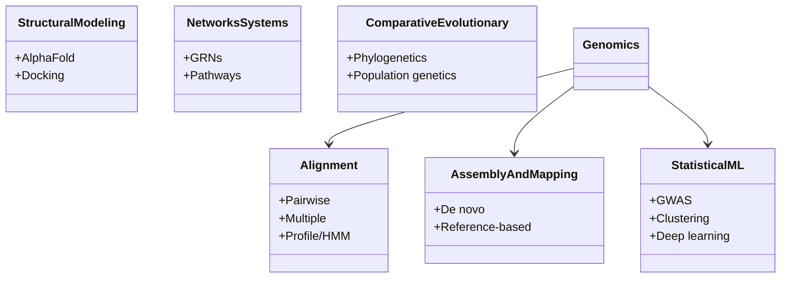

all:

```mermaid
classDiagram
    class Alignment {
      +Pairwise
      +Multiple
      +Profile/HMM
    }
    class AssemblyAndMapping {
      +De novo
      +Reference-based
    }
    class StatisticalML {
      +GWAS
      +Clustering
      +Deep learning
    }
    class StructuralModeling {
      +AlphaFold
      +Docking
    }
    class NetworksSystems {
      +GRNs
      +Pathways
    }
    class ComparativeEvolutionary {
      +Phylogenetics
      +Population genetics
    }

    Genomics --> Alignment
    Genomics --> AssemblyAndMapping
    Genomics --> StatisticalML

    Transcriptomics --> Alignment
    Transcriptomics --> StatisticalML

    Proteomics --> StructuralModeling
    Proteomics --> NetworksSystems
    Proteomics --> StatisticalML

    Metagenomics --> AssemblyAndMapping
    Metagenomics --> Alignment
    Metagenomics --> StatisticalML

    `Phylogenetics & Evolution` --> Alignment
    `Phylogenetics & Evolution` --> ComparativeEvolutionary

    `GWAS & Population Genomics` --> StatisticalML
    `GWAS & Population Genomics` --> ComparativeEvolutionary

    `Systems Biology` --> NetworksSystems
    `Systems Biology` --> StatisticalML

    `Structural Bioinformatics` --> StructuralModeling
    `Structural Bioinformatics` --> Alignment
```

Only genomics:

```mermaid
classDiagram
    class Alignment {
      +Pairwise
      +Multiple
      +Profile/HMM
    }
    class AssemblyAndMapping {
      +De novo
      +Reference-based
    }
    class StatisticalML {
      +GWAS
      +Clustering
      +Deep learning
    }
    class StructuralModeling {
      +AlphaFold
      +Docking
    }
    class NetworksSystems {
      +GRNs
      +Pathways
    }
    class ComparativeEvolutionary {
      +Phylogenetics
      +Population genetics
    }

    Genomics --> Alignment
    Genomics --> AssemblyAndMapping
    Genomics --> StatisticalML
```
