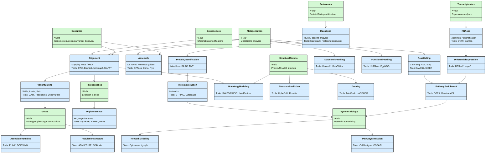

```mermaid
classDiagram
    %% === GENOMICS ===
    class Genomics {
      *Field*
      Genome sequencing & variant discovery
    }
    class Alignment {
      Mapping reads / MSA
      Tools: BWA, Bowtie2, Minimap2, MAFFT
    }
    class Assembly {
      De novo / reference-guided
      Tools: SPAdes, Canu, Flye
    }
    class VariantCalling {
      SNPs, Indels, SVs
      Tools: GATK, FreeBayes, DeepVariant
    }

    Genomics --> Alignment
    Genomics --> Assembly
    Alignment --> VariantCalling

    %% === GWAS / POP GEN ===
    class GWAS {
      *Field*
      Genotype–phenotype associations
    }
    class AssociationStudies {
      Tools: PLINK, BOLT-LMM
    }
    class PopulationStructure {
      Tools: ADMIXTURE, PCAtools
    }

    VariantCalling --> GWAS
    GWAS --> AssociationStudies
    GWAS --> PopulationStructure

    %% === TRANSCRIPTOMICS ===
    class Transcriptomics {
      *Field*
      Expression analysis
    }
    class RNAseq {
      Alignment / quantification
      Tools: STAR, Salmon
    }
    class DifferentialExpression {
      Tools: DESeq2, edgeR
    }
    class PathwayEnrichment {
      Tools: GSEA, ReactomePA
    }

    Transcriptomics --> RNAseq
    RNAseq --> DifferentialExpression
    DifferentialExpression --> PathwayEnrichment

    %% === PROTEOMICS ===
    class Proteomics {
      *Field*
      Protein ID & quantification
    }
    class MassSpec {
      MS/MS spectra analysis
      Tools: MaxQuant, ProteomeDiscoverer
    }
    class ProteinQuantification {
      Label-free, SILAC, TMT
    }
    class ProteinInteraction {
      Networks
      Tools: STRING, Cytoscape
    }

    Proteomics --> MassSpec
    MassSpec --> ProteinQuantification
    ProteinQuantification --> ProteinInteraction

    %% === METAGENOMICS ===
    class Metagenomics {
      *Field*
      Microbiome analysis
    }
    class TaxonomicProfiling {
      Tools: Kraken2, MetaPhlAn
    }
    class FunctionalProfiling {
      Tools: HUMAnN, EggNOG
    }

    Metagenomics --> Alignment
    Metagenomics --> Assembly
    Metagenomics --> TaxonomicProfiling
    Metagenomics --> FunctionalProfiling

    %% === EPIGENOMICS ===
    class Epigenomics {
      *Field*
      Chromatin & modifications
    }
    class PeakCalling {
      ChIP-Seq, ATAC-Seq
      Tools: MACS2, SICER
    }

    Epigenomics --> Alignment
    Epigenomics --> PeakCalling
    PeakCalling --> PathwayEnrichment

    %% === STRUCTURAL BIOINFORMATICS ===
    class StructuralBioinfo {
      *Field*
      Protein/RNA 3D structure
    }
    class HomologyModeling {
      Tools: SWISS-MODEL, ModRefiner
    }
    class StructurePrediction {
      Tools: AlphaFold, Rosetta
    }
    class Docking {
      Tools: AutoDock, HADDOCK
    }

    StructuralBioinfo --> HomologyModeling
    StructuralBioinfo --> StructurePrediction
    StructuralBioinfo --> Docking
    Alignment --> HomologyModeling

    %% === PHYLOGENETICS ===
    class Phylogenetics {
      *Field*
      Evolution & trees
    }
    class PhyloInference {
      ML, Bayesian trees
      Tools: IQ-TREE, RAxML, BEAST
    }

    Alignment --> Phylogenetics
    Phylogenetics --> PhyloInference

    %% === SYSTEMS BIOLOGY ===
    class SystemsBiology {
      *Field*
      Networks & modeling
    }
    class NetworkModeling {
      Tools: Cytoscape, igraph
    }
    class PathwaySimulation {
      Tools: CellDesigner, COPASI
    }

    SystemsBiology --> NetworkModeling
    SystemsBiology --> PathwaySimulation
    PathwayEnrichment --> SystemsBiology
    ProteinInteraction --> SystemsBiology

    %% === STYLING ===
    style Genomics fill:#d4f8d4,stroke:#333,stroke-width:1px
    style GWAS fill:#d4f8d4,stroke:#333,stroke-width:1px
    style Transcriptomics fill:#d4f8d4,stroke:#333,stroke-width:1px
    style Proteomics fill:#d4f8d4,stroke:#333,stroke-width:1px
    style Epigenomics fill:#d4f8d4,stroke:#333,stroke-width:1px
    style Metagenomics fill:#d4f8d4,stroke:#333,stroke-width:1px
    style StructuralBioinfo fill:#d4f8d4,stroke:#333,stroke-width:1px
    style SystemsBiology fill:#d4f8d4,stroke:#333,stroke-width:1px
    style Phylogenetics fill:#d4f8d4,stroke:#333,stroke-width:1px

    style Alignment fill:#d6ecff,stroke:#333,stroke-width:1px
    style Assembly fill:#d6ecff,stroke:#333,stroke-width:1px
    style VariantCalling fill:#d6ecff,stroke:#333,stroke-width:1px
    style AssociationStudies fill:#d6ecff,stroke:#333,stroke-width:1px
    style PopulationStructure fill:#d6ecff,stroke:#333,stroke-width:1px

    style PeakCalling fill:#d6ecff,stroke:#333,stroke-width:1px
    style RNAseq fill:#d6ecff,stroke:#333,stroke-width:1px
    style DifferentialExpression fill:#d6ecff,stroke:#333,stroke-width:1px
    style PathwayEnrichment fill:#d6ecff,stroke:#333,stroke-width:1px
    style PhyloInference fill:#d6ecff,stroke:#333,stroke-width:1px

    style MassSpec fill:#d6ecff,stroke:#333,stroke-width:1px
    style ProteinQuantification fill:#d6ecff,stroke:#333,stroke-width:1px
    style ProteinInteraction fill:#d6ecff,stroke:#333,stroke-width:1px

    style TaxonomicProfiling fill:#d6ecff,stroke:#333,stroke-width:1px
    style FunctionalProfiling fill:#d6ecff,stroke:#333,stroke-width:1px

    style HomologyModeling fill:#d6ecff,stroke:#333,stroke-width:1px
    style StructurePrediction fill:#d6ecff,stroke:#333,stroke-width:1px
    style Docking fill:#d6ecff,stroke:#333,stroke-width:1px

    style NetworkModeling fill:#d6ecff,stroke:#333,stroke-width:1px
    style PathwaySimulation fill:#d6ecff,stroke:#333,stroke-width:1px

    style MultipleAlignment fill:#d6ecff,stroke:#333,stroke-width:1px
    style TreeBuilding fill:#d6ecff,stroke:#333,stroke-width:1px
```
